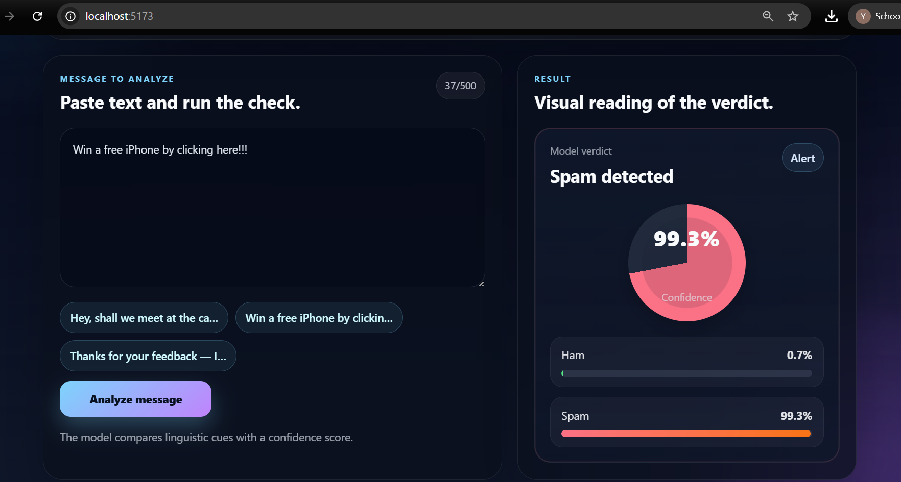

# Spam Detector System (FastText + MLP)

This repository contains a complete end-to-end spam detection system. It uses Natural Language Processing (NLP) techniques, specifically FastText word embeddings, combined with a Multi-Layer Perceptron (MLP) neural network to classify messages as either **Spam** (unwanted/malicious) or **Ham** (legitimate).

The project is divided into two main parts:
1. **Backend**: A Python Flask API that processes text and serves predictions using the trained models.
2. **Frontend**: A modern React application (built with Vite) that provides a user-friendly interface for testing messages in real-time.

---

## Dashboard 



---

## 🧠 Model Architecture & Details

The classification pipeline consists of two main stages: Text Vectorization (FastText) and Classification (MLP).

### 1. Text Preprocessing & FastText Embeddings
Before classification, raw text must be converted into numerical vectors.
* **Preprocessing**: We clean the text by lowercasing, removing URLs, email addresses, mentions (@), hashtags (#), numbers, and punctuation. We also remove common "stop words" to focus on the semantic mean of the message.
* **FastText Model (`fasttext_spam_model.model`)**: We use a pre-trained Gensim FastText model. Unlike Word2Vec, FastText uses subword information (character n-grams). This makes it highly robust against typos, slang, and out-of-vocabulary words often found in spam messages.
* **Document Vector**: For each message, we retrieve the FastText vector for every valid word and compute their average. This produces a single fixed-size 1D vector representing the entire message.

### 2. Multi-Layer Perceptron (MLP) Classifier
* **Pipeline (`spam_detector_pipeline.pkl`)**: Once the document vector is computed, it passes through a scikit-learn pipeline consisting of:
  1. **StandardScaler**: Scales the numerical features (vectors) to have zero mean and unit variance. This step is critical for Neural Networks to learn efficiently.
  2. **MLPClassifier**: A feed-forward Artificial Neural Network (Multi-Layer Perceptron). It takes the scaled vector, passes it through hidden layers with non-linear activation functions (like ReLU), and outputs a probability score using a logistic/softmax function at the output layer.
* **Decision**: If the MLP outputs a score indicating a high probability for class 1, it's flagged as Spam; otherwise, it's Ham.

---

## 📂 Project Structure

```text
detector-spam/
│
├── backend/                       # Flask API Server
│   ├── app.py                     # Main API logic (endpoints, preprocessing)
│   ├── requirements               # Python dependencies
│   ├── fasttext_spam_model.model  # Trained FastText embeddings
│   ├── spam_detector_pipeline.pkl # Trained Scikit-Learn Pipeline (Scaler + MLP)
│   └── spam-detector.ipynb        # Jupyter notebook used for model training
│
├── frontend/                      # React UI
│   ├── package.json               # Node.js dependencies
│   ├── vite.config.js             # Vite bundler configuration
│   ├── index.html                 # Entry HTML
│   └── src/                       # React components and styling (App.jsx, css files)
│
└── data/                          # Datasets
    └── spam.csv                   # Raw dataset used to train the model
```

---

## 🚀 How to Run the Project

### Prerequisites
Make sure you have the following installed on your machine:
* **Python 3.9+** (For the backend)
* **Node.js 18+ & npm** (For the frontend)

### Step 1: Start the Backend (Flask API)
Open a terminal (PowerShell or Bash) and run:

```bash
# Navigate to the backend directory
cd backend

# Create and activate a virtual environment (optional but recommended)
python -m venv .venv
# On Windows PowerShell:
.\.venv\Scripts\Activate.ps1
# On MacOS/Linux:
# source .venv/bin/activate

# Install the required Python packages
python -m pip install -r requirements

# Start the Flask server
python app.py
```
The API will start running at `http://localhost:5000` (by default).

### Step 2: Start the Frontend (React Vite)
Open a **new separate terminal** and run:

```bash
# Navigate to the frontend directory
cd frontend

# Install Node dependencies
npm install

# Start the development server
npm run dev
```
The console will display a local URL (usually `http://localhost:5173`). Open this URL in your web browser to access the Spam Detector UI.

---

## 🔌 API Endpoint Reference

The backend exposes a single POST endpoint for real-time predictions.

**Endpoint:** `POST /predict`

**Headers:**
`Content-Type: application/json`

**Body:**
```json
{
  "message": "Win a free iPhone by clicking here!!!"
}
```

**Response (Success):**
```json
{
  "prediction": "spam",
  "confidence": 0.9854,
  "probabilities": {
    "ham": 0.0146,
    "spam": 0.9854
  }
}
```

---

## 🛠️ Modifying & Retraining the Model
If you wish to retrain the models with new data:
1. Open the `backend/spam-detector.ipynb` notebook.
2. Update the dataset loading logic (pointing to your new `data/spam.csv`).
3. Re-run all cells. It will train a new FastText model and a new MLP pipeline.
4. The `.model` and `.pkl` files will be overwritten in the backend folder.
5. Restart your Flask server (`python app.py`) to load the fresh models into memory.
